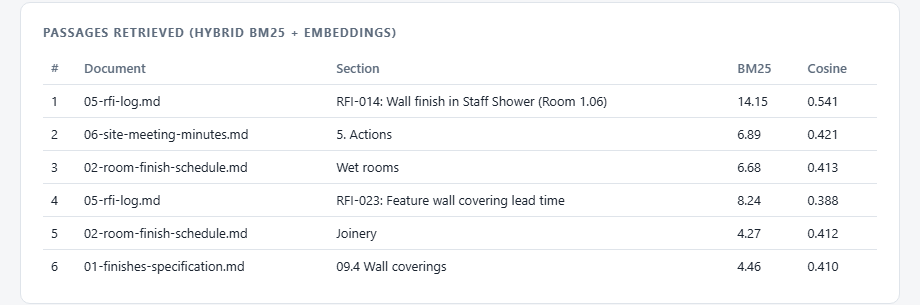

# Project Documents Q&A: a sample RAG system

Ask a question about a construction project and get an answer drawn only from that project's documents, with the exact supporting text quoted beside it. If the documents do not cover the question, the system says so instead of guessing.

The sample document set is a fictional health centre fit-out: a finishes specification, a room finish schedule, a painting method statement (PDF), an inspection and test plan (Word), an RFI log and progress meeting minutes. All of it is synthetic and written for this demo.

## Example

Ask *"What wall finish goes in the staff shower, and has it changed from the original schedule?"* and the search pulls the RFI that made the change, the meeting action to reissue the schedule, and the schedule entry itself, from three different files:



Those passages go to Claude with citations enabled, and the answer comes back as a few sentences, each tied to the exact text it relied on. Ask something the documents do not cover, such as the contract sum, and the reply starts with `NOT IN DOCUMENTS`.

## What it shows

- **Mixed formats.** Markdown, text, PDF and Word are loaded into one common structure with their headings kept.
- **Heading-aware chunking.** A clause or RFI stays whole. Only long sections are split, with a one-sentence overlap.
- **Hybrid retrieval.** BM25 finds exact references such as `RFI-014` or `PT-2`; sentence embeddings find paraphrases such as "hygiene coating" for "anti-microbial paint". The two rankings are merged with reciprocal rank fusion.
- **Embeddings run locally** (`all-MiniLM-L6-v2`), so document text is not sent anywhere to be indexed.
- **Grounded answers with real citations.** Retrieved passages go to Claude as document blocks with citations switched on. The API returns each claim tied to the exact characters it quoted, so the quotes shown are the model's actual evidence and not a second guess made afterwards.
- **Knows when it does not know.** Questions outside the documents come back marked `NOT IN DOCUMENTS`.
- **Handles superseded information.** The schedule says one thing about the staff shower; RFI-014 later changed it. The prompt tells the model that an RFI response overrides the document it refers to.
- **An eval set**, so a change to chunking, retrieval or the prompt can be measured instead of eyeballed.

## Run it

Needs Node 20 or later.

```bash
npm install
npm run make-docs        # renders the PDF and Word samples from corpus-src/
npm run ingest           # chunk, embed and write index/index.json
npm run eval -- --retrieval-only   # no API key needed
```

For answers, copy `.env.example` to `.env`, add an Anthropic API key, then:

```bash
node --env-file=.env src/ask.js "Can we spray the anti-microbial paint in the Treatment Room?"
node --env-file=.env src/eval.js
node --env-file=.env src/server.js     # web UI at http://localhost:3000
```

To use your own documents, put `.md`, `.txt`, `.pdf` or `.docx` files in a folder and run `npm run ingest -- path/to/folder`.

## Results

Retrieval, 12-question eval set (10 answerable, 2 deliberately unanswerable), top 6 passages:

| Measure | Result |
|---|---|
| Expected document retrieved in top 6 | 10 of 10 |
| Expected document at rank 1 | 9 of 10 |

The one question not at rank 1 asks for a specification limit and the latest site readings together; the specification ranks first and the minutes, which hold the readings, rank fourth. Both reach the model.

This is a small eval written alongside a small corpus, so treat it as a regression check and not as a benchmark. On a real project the first job is to build the eval from questions the team actually asks.

## Licence

MIT. The sample documents are fictional and were written for this demo; the project, companies and people in them do not exist.

## How it fits together

```
corpus/ (.md .pdf .docx)
   -> load.js      text + headings per document
   -> chunk.js     one chunk per section, long sections split
   -> embed.js     local embeddings
   -> index/index.json

question
   -> retrieve.js  BM25 + cosine, reciprocal rank fusion, top 6
   -> answer.js    Claude with citations enabled on each passage
   -> answer, numbered sources, exact quotes
```

## What I would change for production

- Replace the JSON index with Postgres and pgvector, or Qdrant, once the corpus passes a few thousand chunks.
- Add OCR for scanned PDFs, and flag image-only pages for a person to check instead of indexing nothing silently.
- Carry document metadata (revision, date, status) into retrieval so a superseded revision is never quoted as current.
- Apply per-user document permissions at retrieval time.
- Log every question, the passages retrieved and the answer, and grow the eval set from real questions.
